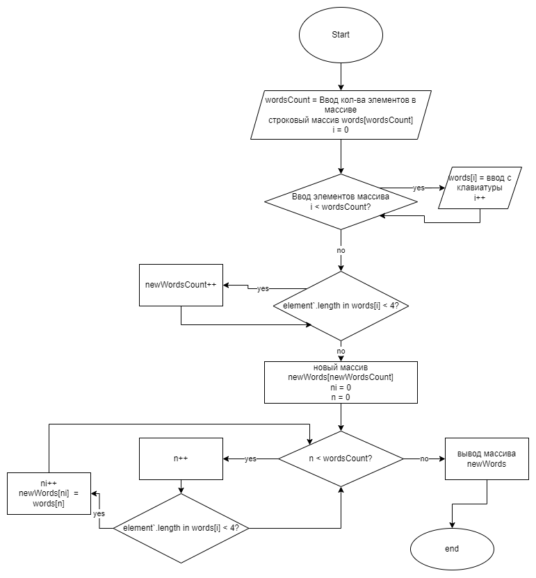

# Итоговая проверочная работа.

## Задача:
Написать программу, которая из имеющегося массива строк формирует массив их строк, длина которых **меньше либо равна** *3 символа*. Первоначальный массив - с клавиатуры или на старте. лучше обойтись массивами.

## Необходимо:
1. Создать репозиторий в GitHub
2. Нарисовать блок-схему алгоритма
3. Снабдить репозиторий текстовым описанием решения (файл README.md)
4. Написать программу, решающую поставленную задачу
5. Использовать коммиты

Блок схема:
